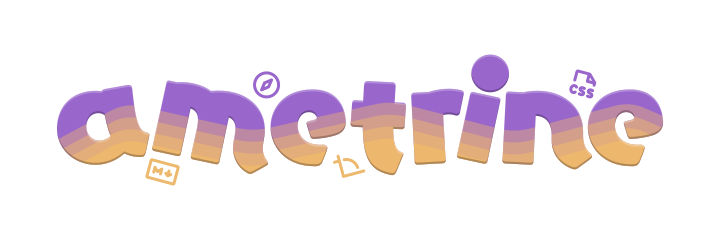

+++
title = "ana sayfa"
insert_anchor_links = "left"
[extra]
no_header = true
+++

  <a class="suggested" href="/demo/">stres testi (site deneme sayfası) →</a>
  <button class="external">kaynak kodu (skidler için)</button>

# blo(c)k 
<!-- ## <mark><marquee scrollamount="13">geliştirme aşamasında</marquee></mark> -->

***
evet, bu aptal blog için arkadaşlarımdan isim istedim ve en iyi ve havalı isim buydu <small>evet evet, en iyi isim basbayağı *blok* idi</small>.

siteyi biraz incelediyseniz bu sitenin bir de ingilizce çevirisini görebilirsiniz, bu yüzden minik bir değişiklik yaparak bu ismi aldım.

## daha neyi geliştiriyor olabilirsin aw-
daha bir sürü şeyi. mesela:
- özel kısa kodlar ve stiller
- daha iyi (ve havalı) ana sayfa
- daha fazla içerik ve özellikler
- daha iyi (ve havalı) bir blog deneyimi <small>(ne, aynı cümleyi yine mi kullandım? bunu görmezden gelip alay mı ediyormuşum bir de? <del>sanane olm</del>)</small>

şaka bir yana, bu siteyi geliştirirken amacım neydi, biliyor musunuz?

  
geliştirme hedeflerim

  <ul>
    <li>kafa dağıtmak</li>
    <li>rahat ve özgürce konuşup bilgi paylaşabileceğim bir yer oluşturmak</li>
    <li>deneyim kazanmak</li>
    <li>hasan hocadan kaçmak 😀</li>
  </ul>  

